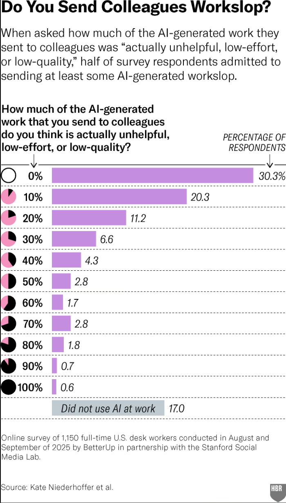
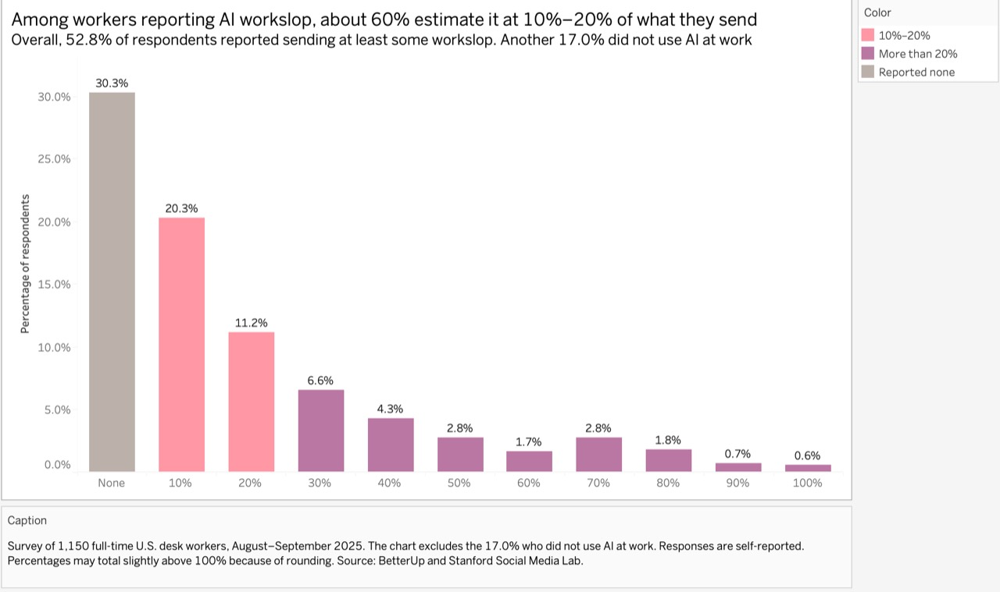
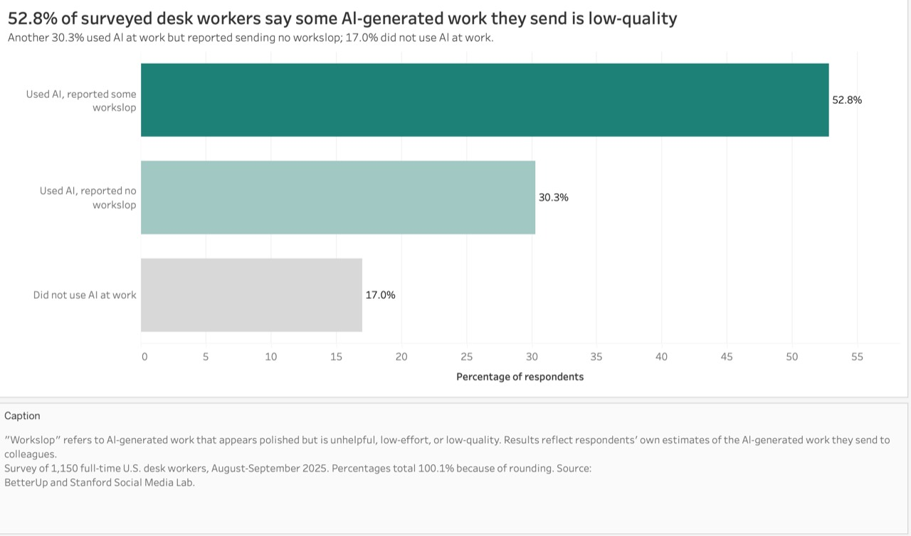

| [Home](./) | [Data visualization examples](dataviz-examples) | [Visualizing Government Debt](visualizing-government-debt) | [Critique by Design](critique-by-design) | [Final project I](final-project-part-one) | [Final project II](final-project-part-two) | [Final project III](final-project-part-three) |

# Redesigning “Do You Send Colleagues Workslop?”

For this critique-by-design assignment, I redesigned the Harvard Business Review chart [“Do You Send Colleagues Workslop?”](https://hbr.org/2026/01/why-people-create-ai-workslop-and-how-to-stop-it). The chart uses a survey of 1,150 full-time U.S. desk workers conducted by BetterUp and the Stanford Social Media Lab in August and September 2025. Respondents estimated how much of the AI-generated work they sent to colleagues was unhelpful, low-effort, or low-quality, which the study calls “workslop.”

I selected this visualization because the topic is timely and the original data is available through [MakeoverMonday](https://makeovermonday.vercel.app/dataset/2026w13-ai-workslop). I was also interested in a tension in the original chart: the individual bars are readable, but the headline uses a different reference group from the percentages shown in the chart. This made it a useful case for studying how labels, denominators, and visual emphasis affect interpretation.

*Original visualization: Kate Niederhoffer et al., Harvard Business Review, 2026.*

## Step one: understanding the visualization

The original chart asks respondents what share of the AI-generated work they send to colleagues is workslop. Its categories have three different meanings:

- 17.0% did not use AI at work.
- 30.3% used AI but reported that none of the AI-generated work they sent was workslop.
- 52.8% used AI and reported that at least some of the AI-generated work they sent was workslop.

The bars from 10% through 100% break down the last group. For example, the 20.3% bar means that 20.3% of all survey respondents estimated that 10% of the AI-generated work they sent was workslop. It does not mean that 20.3% of their work was AI-generated.

The original article's “about 60%” statement uses another denominator. The 10% and 20% response categories account for 31.5% of all respondents. Dividing 31.5% by the 52.8% who reported any workslop gives 59.7%. In other words, about 60% of respondents who reported sending some workslop placed themselves in the 10% or 20% categories.

## Step two: critique

I used Stephen Few's Data Visualization Effectiveness Profile to examine the chart's usefulness, completeness, perceptibility, truthfulness, intuitiveness, aesthetics, and engagement. The chart communicates a relevant finding and provides the survey source, sample size, and values. The descending bars also make the distribution easy to scan.

The primary audience appears to be HBR readers, workplace leaders, and employees who use AI at work. The topic is relevant to this audience, but the changing denominator makes the original chart's main claim harder to verify.

The main weakness is the shift in denominators. The headline refers to the subgroup who reported some workslop, while the bar labels use all survey respondents. A reader cannot verify the 60% statement directly without calculating `(20.3 + 11.2) / 52.8`. The “None” category is also ambiguous because it may sound like the respondent did not use AI, even though it means the person used AI but reported no workslop. The 17.0% who did not use AI appears separately below the chart, so the bars sum to about 83% rather than 100%.

The exercise showed me that Stephen Few's profile is useful for checking whether a chart functions clearly and truthfully. The Good Charts framework pushed me to think more about the idea I wanted the audience to remember. I decided that the redesign should prioritize a comparison that uses one denominator instead of trying to preserve every detail of the original distribution.

## Step three: prototype

My first Tableau prototype kept the full 0%–100% distribution. I renamed the 0% category “None,” highlighted the 10% and 20% bars, and added a headline explaining that about 60% of workslop senders selected those categories.

This version was useful as a wireframe because it exposed the problem I needed to solve. Even with a longer title and caption, the 60% figure still depended on a denominator that was not visible in the bars. The chart also carried more labels and color categories than its main point required.

## Step four: peer testing

I prepared five questions and asked reviewers to interpret the prototype before I explained it:

1. What do you think this chart is showing?
2. What is the main message?
3. What does “about 60%” mean?
4. What do the colors represent?
5. Is anything confusing, and what would you change?

I first shared the prototype with one graduate student for an independent review. I later discussed it with three classmates during an in-class group critique. Because the classmates discussed the chart together, I recorded their feedback collectively rather than assigning comments to individuals.

| Reviewers | What they understood | What caused confusion | Suggestions |
|---|---|---|---|
| Graduate student, independent review | The chart showed workers' estimates of how much AI-generated work they sent was workslop. | The 60% headline and bars used different reference groups. “None” could be mistaken for not using AI, and the excluded 17% made the displayed values total about 83%. | Define workslop, clarify the denominator, rename “None,” and make the comparison visible. |
| Three graduate students, in-class group critique | The highlighted bars appeared to be the intended focus. | The title did not explain who the 60% represented. “None,” the dense labels, and the missing legend made the chart harder to interpret. | Use clearer categories, fewer labels, softer colors, and a direct comparison between the majority and smaller groups. |

Both sessions pointed to the same underlying problem: my prototype still mixed percentages based on different groups. The reviewers also made me realize that adding explanations around an unclear structure was not enough. I needed to change the structure itself.

## Step five: final redesign

I regrouped the original responses into three mutually exclusive categories that share the same denominator:

- Used AI and reported some workslop: 52.8%
- Used AI and reported no workslop: 30.3%
- Did not use AI at work: 17.0%

The final chart uses horizontal bars so the category labels can be written out. I removed the 60% claim, the ambiguous “None” label, the extra number labels, and the separate legend. A dark teal bar emphasizes the majority category, a lighter teal shows other AI users, and gray separates respondents who did not use AI at work. I kept bar length as the only size encoding because varying both length and width would repeat the same information.

[Open the final redesign on Tableau Public](https://public.tableau.com/app/profile/jessica.zhang5342/viz/Book1_17895152369570/FinalRedesign)

The redesign answers a simpler question than the original distribution: how were all respondents divided among workslop senders, AI users who reported none, and non-users? It gives up the detail within the 10%–100% responses, but the main comparison can now be understood without calculation. All three percentages use the full survey sample as their denominator and total 100.1% because of rounding.

## References

- Kate Niederhoffer et al. [“Why People Create AI Workslop—and How to Stop It.”](https://hbr.org/2026/01/why-people-create-ai-workslop-and-how-to-stop-it) *Harvard Business Review*, January 2026.
- [MakeoverMonday 2026 Week 13: AI Workslop](https://makeovermonday.vercel.app/dataset/2026w13-ai-workslop).
- Stephen Few. *Data Visualization Effectiveness Profile*.
- Scott Berinato. *Good Charts Workbook*, Chapters 3–4.

## AI acknowledgement

I used ChatGPT to help me organize anonymized peer-feedback notes and revise the writing.
