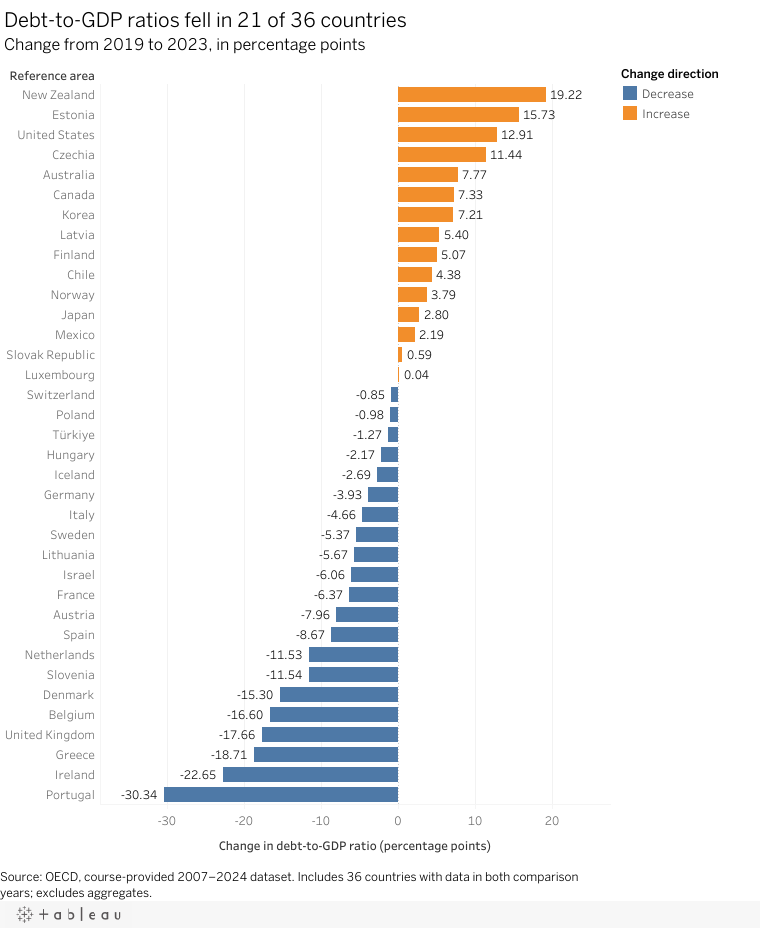
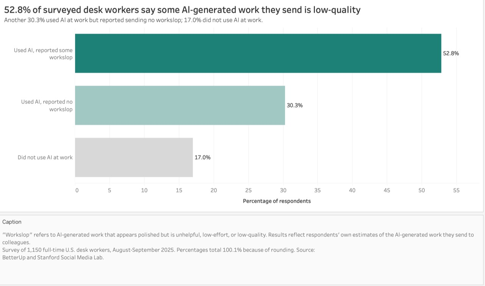

| [Home](https://jessica-jz.github.io/Jessica-Zhang-portfolio/) | [Data visualization examples](https://jessica-jz.github.io/Jessica-Zhang-portfolio/dataviz-examples) | [Visualizing Government Debt](https://jessica-jz.github.io/Jessica-Zhang-portfolio/visualizing-government-debt) | [Critique by Design](https://jessica-jz.github.io/Jessica-Zhang-portfolio/critique-by-design) | [Final project I](https://jessica-jz.github.io/Jessica-Zhang-portfolio/final-project-part-one) | [Final project II](https://jessica-jz.github.io/Jessica-Zhang-portfolio/final-project-part-two) | [Final project III](https://jessica-jz.github.io/Jessica-Zhang-portfolio/final-project-part-three) |

# Data visualization examples

Two projects from Telling Stories with Data show how I use chart choice, labels, and context to make a comparison clearer. Each project page includes the design process and a link to the interactive chart.

## Visualizing Government Debt

The chart compares percentage-point changes in debt-to-GDP ratios across 36 countries. [View the chart, Tableau version, and design notes](https://jessica-jz.github.io/Jessica-Zhang-portfolio/visualizing-government-debt).

## Critique by Design

I grouped responses from an AI-at-work survey into three categories that use the same denominator. [Read the critique, peer feedback, and final redesign](https://jessica-jz.github.io/Jessica-Zhang-portfolio/critique-by-design).

[Return to the portfolio home page](https://jessica-jz.github.io/Jessica-Zhang-portfolio/).
