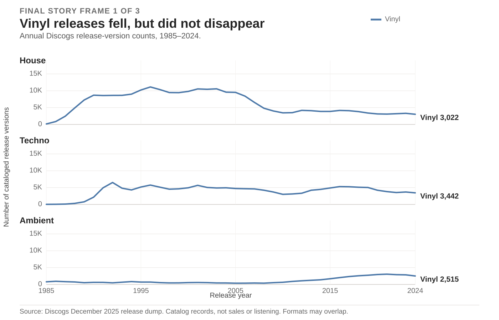
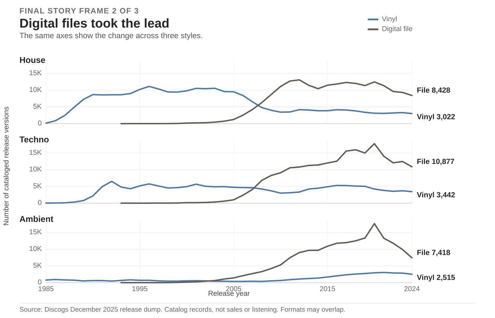
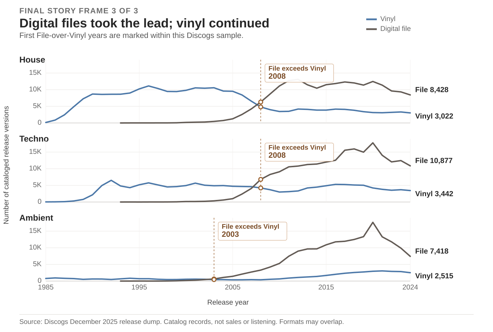

| [Home](https://jessica-jz.github.io/Jessica-Zhang-portfolio/) | [Final project I](https://jessica-jz.github.io/Jessica-Zhang-portfolio/final-project-part-one) | [Final project II](https://jessica-jz.github.io/Jessica-Zhang-portfolio/final-project-part-two) | [Part III: behind the story](https://jessica-jz.github.io/Jessica-Zhang-portfolio/final-project-part-three) |

# Digital files took the lead. Vinyl releases continued.

*House, Techno, and Ambient in the Discogs catalog, 1985–2024*

Digital files became the more common release format in this Discogs sample. Vinyl did not vanish, although its count fell sharply in House. The charts below follow one comparison through three views: vinyl first, then digital files, then the years when digital-file counts moved ahead.

Each line counts **cataloged release versions**, not albums sold or people listening. A vinyl edition and a download of the same album are two release versions. Discogs calls the latter format `File`; I use “digital file” in the story. These labels describe the release medium, not how the music was recorded or mastered.

## 1. What happened to vinyl?

[Open the first chart at full size](assets/final-project-part-three/story-frame-1.svg).

Vinyl release versions are still present in all three styles in 2024. That does not mean they held steady: House fell from 11,121 at its 1996 peak to 3,022 in 2024. The shared scale helps show both the decline and the continued count.

## 2. Add digital files

[Open the second chart at full size](assets/final-project-part-three/story-frame-2.svg).

Digital-file release versions rose past vinyl in each style. By 2024, Discogs listed 8,428 File versions versus 3,022 Vinyl versions for House, 10,877 versus 3,442 for Techno, and 7,418 versus 2,515 for Ambient. The styles are three case studies of the same format shift, rather than a ranking of electronic music.

## 3. Mark the crossover

[Open the annotated chart at full size](assets/final-project-part-three/story-frame-3.svg).

In these filtered records, File first exceeded Vinyl in 2008 for House and Techno and in 2003 for Ambient. The dates identify crossovers in a catalog snapshot. They are not dates when listeners switched formats or when the music industry as a whole changed.

| Style | 2024 File versions | 2024 Vinyl versions |
|---|---:|---:|
| House | 8,428 | 3,022 |
| Techno | 10,877 | 3,442 |
| Ambient | 7,418 | 2,515 |

Digital-file versions took the lead in this Discogs sample, while thousands of vinyl versions remained cataloged through 2024.

## How to read this evidence

I filtered the [December 2025 Discogs release dump](https://data.discogs.com/) to records dated 1985–2024, tagged `Electronic` and at least one of House, Techno, or Ambient, and issued in at least one of Vinyl, CD, or File. The annual lines count distinct release IDs within each style and format. A release can carry more than one format tag, so the lines can overlap; they are not shares of a 100% whole. The full filters, exclusions, and downloadable summary are in the [data documentation](data/final-project-part-one/README.md).

Discogs is a community-built catalog, and coverage may differ across formats, years, and styles. This comparison excludes releases that have only other formats. That matters most for Ambient: in 2024, Vinyl, CD, or File appeared on 76.9% of the Ambient records in scope, and cassette appeared on 13.3%. The two-line chart is therefore not a full account of Ambient's physical releases. Physical editions may also be more likely to be cataloged than digital-only editions; this is a possible bias, not a measured adjustment.

The first File-tagged records in this filtered sample appear in 1993. That is not the date of the first digital music release. Likewise, the downward lines after 2020 describe this December 2025 catalog snapshot; later community entries can change recent-year counts. These data do not measure sales, listening, format preference, or sound quality.

## Sources and image credits

- Discogs, [monthly data dumps](https://data.discogs.com/), December 2025 release snapshot. Discogs describes the dump as CC0 on its download page.
- Discogs, [Database Guidelines 6: Format](https://support.discogs.com/hc/en-us/articles/360005006654-Database-Guidelines-6-Format), for format definitions.
- [Cleaned data, filters, and validation notes](data/final-project-part-one/README.md); [annual format counts used in these charts](data/final-project-part-one/discogs-annual-style-format-counts.csv).
- The three charts on this page were generated for this project from the Discogs summary. No third-party photographs, album covers, or logos are used. The [Part III process page](final-project-part-three) documents the design changes and AI assistance.
