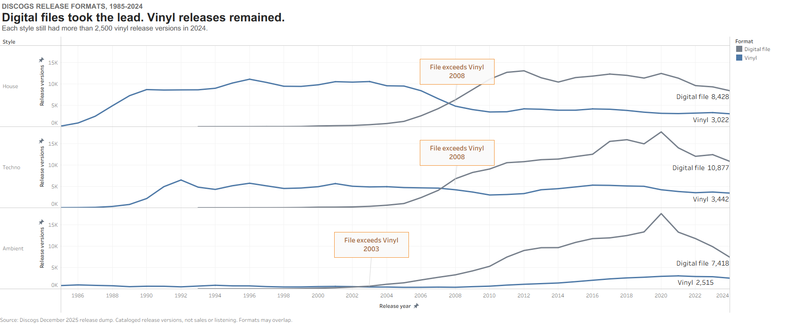

| [Home](https://jessica-jz.github.io/Jessica-Zhang-portfolio/) | [Visualizing Government Debt](https://jessica-jz.github.io/Jessica-Zhang-portfolio/visualizing-government-debt) | [Critique by Design](https://jessica-jz.github.io/Jessica-Zhang-portfolio/critique-by-design) | [Final project I](https://jessica-jz.github.io/Jessica-Zhang-portfolio/final-project-part-one) | [Final project II](https://jessica-jz.github.io/Jessica-Zhang-portfolio/final-project-part-two) | [Final project III](https://jessica-jz.github.io/Jessica-Zhang-portfolio/final-project-part-three) |

# Digital files took the lead. Vinyl releases remained. {#the-final-data-story}

*House, Techno, and Ambient in the Discogs catalog, 1985–2024*

Did vinyl disappear as digital files took the lead? In this Discogs sample, it remained in all three styles, although House vinyl releases fell sharply from their 1996 peak.

Each line counts **cataloged release versions**, not albums sold or people listening. A vinyl edition and a download of the same album count as two versions. Discogs labels the download format `File`; I call it “digital file” here. The format tag describes the release medium, not how the music was recorded or mastered.

[Open the final chart at full size](assets/final-project-part-three/final-chart-tableau.png).

Vinyl versions are still cataloged in all three styles in 2024. That does not mean the counts held steady: House fell from 11,121 Vinyl versions at its 1996 peak to 3,022 in 2024. In that same year, House had 8,428 File versions. The other two styles show the same format ordering: Techno had 10,877 File and 3,442 Vinyl versions; Ambient had 7,418 File and 2,515 Vinyl versions.

File first exceeded Vinyl in 2008 for House and Techno and in 2003 for Ambient. These are crossover years in the filtered Discogs catalog, not dates when listeners switched formats. The three panels show the pattern in these selected styles; they do not rank electronic music as a whole.

To read this evidence, start with what the lines count. I filtered the [December 2025 Discogs release dump](https://data.discogs.com/) to records dated 1985–2024, tagged `Electronic` and at least one of House, Techno, or Ambient, and issued in Vinyl, CD, or File. The lines count distinct release IDs within each style and format. A release can have more than one format tag, so these counts do not add up to a 100% whole. The [data documentation](data/final-project-part-one/README.md) records the full filters and exclusions.

Discogs is a community-built catalog, and its coverage may differ across formats and years. The comparison excludes releases tagged only with other formats. Among all 2024 Ambient releases tagged Electronic in this snapshot, 76.9% had Vinyl, CD, or File and 13.3% had Cassette; those groups can overlap. The chart is therefore not a full account of Ambient's physical releases. Physical editions may also be more likely to be cataloged than digital-only editions; I have not measured that possible bias.

The first File-tagged records in this filtered sample appear in 1993. That is not the date of the first digital music release. The downward lines after 2020 describe this December 2025 snapshot; later catalog entries can change recent-year counts. These data cannot establish sales, listening, format preference, or sound quality.

# Changes made since Part II

In Part I, I compared Vinyl, CD, and File and tested sketches using format shares, release counts, and a master-level check. Part II narrowed the reader-facing question to whether vinyl disappeared after files took the lead. I built a three-frame Tableau storyboard, then used three full interviews and two focused critiques to test its wording and visual sequence. This page presents the complete comparison before the methods and design process.

The title now states the two-part result, and the chart subtitle gives the 2024 threshold of more than 2,500 Vinyl versions in each style. I put House's decline from its 1996 peak in the opening so “remained” does not sound like “held steady.” The definition of a release version appears before the chart, where readers need it.

The [Part II storyboard](final-project-part-two#storyboard) reveals the comparison in three progressive Tableau views with the same scales, panel order, and colors. This page shows the complete comparison. I darkened the File line for legibility and kept a full-size chart link so readers can inspect the labels when the page is narrow.

I moved the Ambient cassette context below the main finding, into the limitations paragraph, because the two-format lines do not cover every Ambient record. I also kept the three styles as supporting examples rather than making Ambient's earlier crossover the central claim.

## The audience

I wrote for electronic-music listeners who use digital access but still encounter vinyl editions through DJs, record shops, or label releases. They may know House, Techno, and Ambient without knowing Discogs's database fields. The story therefore defines a release version above the chart: a vinyl edition and a download of one album count as separate versions. It also says early that a format tag is not evidence about recording technology, sales, or listening.

Part II supplied three full interviews and two focused classmate critiques. Across the full interviews, readers understood the main format shift, but “vinyl remained” sounded too vague when House vinyl counts had fallen substantially. Two readers hesitated over “release version.” The focused critiques raised line contrast and label size. I treated these five responses as feedback on the page, not as a representative sample of all electronic-music listeners. I did not conduct another interview round for this final page.

## Final design decisions

The final page uses one familiar line chart for change over time. Vinyl is blue and File is warm gray, with the format names repeated in the text. Direct 2024 counts and crossover annotations point to the evidence without making readers reconstruct it. The y-axis starts at zero and has the same scale in every panel. I avoided a 100% stacked chart because one Discogs release can have more than one format tag. The story and process live together on GitHub Pages under the course template.

## References

- Discogs, [monthly data dumps](https://data.discogs.com/), `discogs_20251201_releases.xml.gz` release snapshot. Discogs states that the dump is CC0 No Rights Reserved. The [Part I data section](final-project-part-one#data) records the snapshot, filtering steps, and limitations.
- Discogs, [Database Guidelines 6: Format](https://support.discogs.com/hc/en-us/articles/360005006654-Database-Guidelines-6-Format), for format tags.
- Berinato, Scott. [*Good Charts: The HBR Guide to Making Smarter, More Persuasive Data Visualizations*](https://store.hbr.org/product/good-charts-the-hbr-guide-to-making-smarter-more-persuasive-data-visualizations/15005). Harvard Business Review Press, 2016, Chapter 7, “Persuasion or Manipulation? The Blurred Edge of Truth.” I used its distinction between visual emphasis and an unsupported conclusion.
- [GitHub repository](https://github.com/jessica-JZ/Jessica-Zhang-portfolio), [data preparation documentation](data/final-project-part-one/README.md), and [processed release records](https://github.com/jessica-JZ/Jessica-Zhang-portfolio/blob/main/data/final-project-part-one/discogs-electronic-formats-1985-2024.csv.gz).
- The final chart is a Tableau export made from the processed Discogs release records. This page uses no third-party photographs, album covers, or logos. [Part II](final-project-part-two#storyboard) shows the comparison in three Tableau stages.

## AI acknowledgements

I chose the topic, decided which feedback to use, and remain responsible for the final interpretation. I used ChatGPT to check the Discogs processing workflow and revise the story and this write-up. A separate simulated target-audience critique informed early design thinking. ChatGPT did not generate or alter participants' comments.

# Final thoughts

I began with a wider format story that included CD, percentages, and a separate master-level view. Feedback on Part I and interviews in Part II helped me narrow the public story to File and Vinyl; the other measures remain in the data and methods pages. The release-version lines show coexistence in the catalog, but they cannot explain why people choose vinyl or how many copies sold. I would test this finished page with readers if I had another round; the feedback reported here came from Part II.
