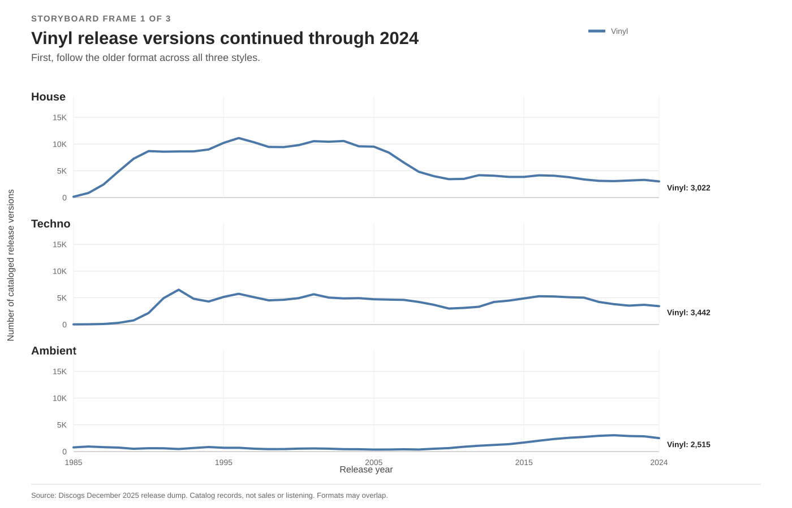
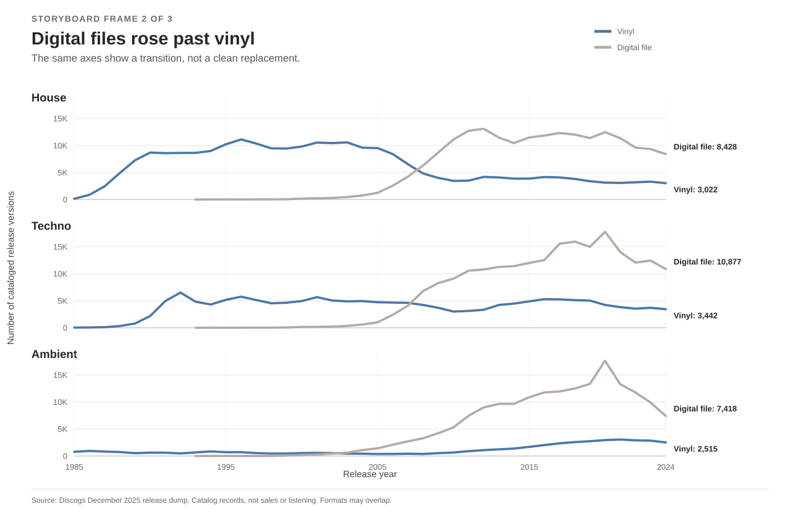
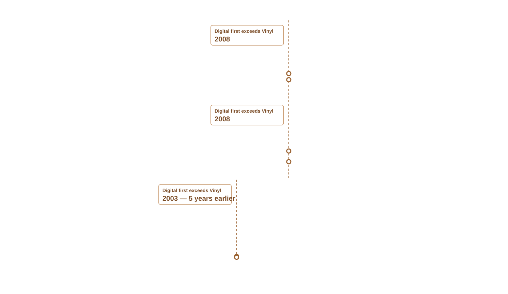

| [Home](https://jessica-jz.github.io/Jessica-Zhang-portfolio/) | [Visualizing Government Debt](https://jessica-jz.github.io/Jessica-Zhang-portfolio/visualizing-government-debt) | [Critique by Design](https://jessica-jz.github.io/Jessica-Zhang-portfolio/critique-by-design) | [Final project I](https://jessica-jz.github.io/Jessica-Zhang-portfolio/final-project-part-one) | [Final project II](https://jessica-jz.github.io/Jessica-Zhang-portfolio/final-project-part-two) | [Final project III](https://jessica-jz.github.io/Jessica-Zhang-portfolio/final-project-part-three) |

# Wireframes / storyboards

This page records the storyboard and reader feedback from Part II. The completed story appears in [Part III](final-project-part-three).

**Working story title:** *In the Discogs Catalog, Digital Files Took the Lead—but Vinyl Records Remained.*

## Story direction

Electronic-music listeners can encounter the same release as both a download and a 12-inch record. For listeners who use digital access but still see vinyl in record shops and label catalogs, format history shows whether digital distribution replaced physical editions or changed how the two coexist. This project asks: once digital-file releases became more common, did vinyl-record releases disappear?

I use annual cataloged release-version counts for House, Techno, and Ambient from 1985 through 2024. One small-multiple line chart compares the two formats, with the three styles serving as supporting cases rather than a ranking. In the Discogs catalog, digital files took the lead while vinyl continued at a lower level. House vinyl releases, for example, fell from a peak of 11,121 in 1996 to 3,022 in 2024.

I created the high-fidelity chart in Tableau. The final reader-facing story will use Shorthand as a scroll-based presentation, while this GitHub page documents the Part II storyboard, data decisions, and user-research plan.

`File` and `Vinyl` are Discogs format tags. In the reader-facing text, I describe them as “digital file (download)” and “vinyl record.” A release version is one edition of a recording: a vinyl edition, a Japanese CD edition, and a FLAC download of the same album count as three release versions. The tags describe the release medium rather than the recording technology. These counts do not measure sales, listening, or popularity.

## Storyboard

This Part II storyboard shows one chart in three progressive states. The first two are simplified reveal frames, and the third is the high-fidelity Tableau endpoint. The panel order, time range, count scale, and color meaning remain constant. The endpoint uses Tableau typography and legend styling, so these frames represent the planned progression rather than a literal animation.

### Story beat 1: Begin with the visual contradiction

The opening places the chart near the beginning and asks what happened to vinyl records after digital-file releases moved ahead.

### Story beat 2: Reveal the evidence in one main chart

The main visual has aligned House, Techno, and Ambient panels. Each panel shows annual numbers of cataloged Digital File and Vinyl Record release versions from 1985 through 2024. Vinyl uses blue, while Digital File uses a quiet warm gray. Direct 2024 labels reduce eye travel between the lines and legend. All panels use the same time range and count scale.

A note beside the chart defines one release version as a format-specific edition rather than a sale or a unique album.

#### Progressive state 1: Establish that vinyl remained

The first state asks one question: did vinyl approach zero? The blue lines remain visible through 2024 in all three panels.

#### Progressive state 2: Add the format that took the lead

The second state adds Digital File without changing the axes. Readers can now see both the crossover and the continued presence of vinyl rather than interpreting the change as complete replacement.

#### Progressive state 3: Annotate the crossovers

The final state marks the first year Digital File exceeded Vinyl Record: 2003 for Ambient and 2008 for House and Techno. Ambient crossed five years earlier.

> Ambient context: in 2024, Vinyl, CD, or File appeared on 76.9% of the Ambient records in scope, while cassette appeared on 13.3%. The two-line chart therefore does not represent Ambient's full physical-format mix.

CD does not appear in the main chart because the central comparison is Digital File versus Vinyl Record. One release may have more than one format tag, so the two lines are separate counts rather than parts of a 100% total.

### Story beat 3: Resolve the question and define its limits

The ending answers the opening question: Digital File releases took the lead in this Discogs sample while vinyl records continued to appear in thousands of cataloged versions. The chart note identifies Discogs and the unit of analysis. The master-level sensitivity check remains on the Part I page.

The limitations note explains that Discogs is a user-contributed collector database. Physical releases may be more likely to be cataloged than digital-only releases, so the catalog may make vinyl look more persistent than the full release market. This is a possible source of bias, not a measured correction factor.

The first File-tagged records in this filtered sample appear in 1993; that is not a claim about the first downloadable music release. The December 2025 snapshot may also receive additional community entries for recent release years. The post-2020 decline should therefore be read as a pattern in the catalog snapshot, not as proof that the broader market declined by the same amount.

In the final Shorthand story, a reader should be able to scroll through the three states, identify both formats without outside explanation, and summarize the conclusion in one sentence. Readers who want the analytical details can continue to the limitations without interrupting the main story.

### High-fidelity draft

The third frame uses my Tableau chart as the high-fidelity endpoint and adds the crossover annotations. Its direct 2024 labels, axes, legend, and source note allow it to be understood on its own.

> Part II participant instruction: please stop here after reviewing the storyboard. I will ask the interview questions before you read the process notes and research plan below.

## How Part I feedback shaped this storyboard

The comments below were made about my Part I sketches. I used them as preliminary design input for the revised Part II storyboard. They are separate from the Part II interviews described later on this page. One additional critique was framed as a simulated target-audience pretest; I use it only as design critique, not as a completed interview.

| Feedback on the Part I sketches | Change made in the Part II storyboard |
|---|---|
| The intended audience and central story were difficult to identify. | I narrowed the audience to electronic-music listeners who mainly use digital access but still encounter vinyl editions. Every frame now examines whether the rise of digital-file releases meant that vinyl records disappeared. |
| Sketch 2 was the clearest direction. | I selected one digital-file-versus-vinyl time-series figure instead of carrying five competing directions forward. |
| The sketches needed clearer legends, axes, units, and annotations. | The revised storyboard includes a claim-based title, named axes, a shared scale, 2024 labels, crossover annotations, and the Discogs source. |
| The miniature vinyl-count and total-catalog lines were difficult to interpret. | I removed both placeholders. The main chart uses annual counts to show the crossover and vinyl's continued presence. |
| The master-level comparison was difficult to understand. | I moved the master-level sensitivity check to a methods note so the main story keeps one unit of analysis. |
| Connectors between File and Vinyl dots implied a continuum or a 100% total. | I removed the connected-dot designs because the format categories can overlap. |
| The amount of detail created too much cognitive load. | I reduced the reader-facing story to one chart shown in three progressive states and moved technical detail below the main narrative. |
| “File” and “release version” were difficult for a general reader to interpret. | The chart uses “Digital File” and “Vinyl Record,” while the text defines a digital file as a download and explains release versions with a concrete album-edition example. |
| Definitions and methodology delayed the main evidence. | I shortened the definitions and placed them immediately before the storyboard, while keeping detailed limitations below the frames. |
| The title made vinyl's continued presence sound more positive than the comparison warranted. | The working title states that digital files took the lead before it says that vinyl records remained. |
| Ambient's cassette releases and Discogs's collector-community coverage could change the interpretation. | The storyboard adds an Ambient context note and a concise limitation about possible cataloging bias. |

# User research

## Target audience

The primary audience is electronic-music listeners who mainly use streaming or downloads but still encounter vinyl through DJs, record shops, or label releases. They may recognize House, Techno, and Ambient, but they are not expected to know how Discogs organizes its database.

These listeners may assume that a newer format replaces an older one. After reading the story, they should be able to explain how digital files became the dominant cataloged format while vinyl records remained present. They should also be able to use the chart as evidence without treating catalog counts as proof that vinyl became more popular.

I first interviewed three people with different levels of familiarity with the course: a current classmate, a former student, and a Data Science student who is not enrolled in the class. Two additional classmates enrolled in the course later provided focused critiques of the page. This mix let me test the story with readers who understand the course's visualization principles and with a reader outside the course. I treat all five responses as usability feedback on the story and charts rather than a representative audience sample. I do not include names or other identifying information.

## Interview script

### Research goals

The protocol tests whether readers can identify the intended audience, central question, and main comparison in the revised Part II storyboard. It also tests whether readers understand the unit of analysis and the limits of the data.

### Interview procedure

Each participant viewed the revised page through the Part II participant instruction before reading the process notes or research plan. The page included story-direction text before the charts, so that framing may have influenced their interpretations. I asked the same core questions and took anonymous notes. I recorded whether each answer showed clear, partial, or incorrect understanding. I then compared repeated observations with conflicting interpretations rather than treating every suggestion as a required change.

### Questions

| Research goal | Question |
|---|---|
| Test whether the audience is apparent | Who do you think this story is for? |
| Test whether the central question is clear | In one sentence, what do you think this story is trying to explain? |
| Test the main comparison | What does the main chart want you to notice? |
| Test the main conclusion | How would you describe the change in vinyl releases over this period? What evidence led you to that answer? |
| Test the unit of analysis | What do you think “release version” means here? |
| Test the style comparison | What difference, if any, do you notice among House, Techno, and Ambient? |
| Test chart readability | Point to the year when digital-file releases first exceeded vinyl releases for Techno. |
| Test the limits | What can this data tell us, and what can it not tell us? |
| Identify friction | Where did you feel confused, uncertain, or less interested? |
| Invite redesign suggestions | What would you change first? |

## Interview findings

Five people provided Part II feedback. Interviews 1 through 3 followed the full interview protocol. Interviews 4 and 5 were with classmates enrolled in the course who provided focused critiques, so I report only the observations they actually made. Interviews 1 through 4 include one anonymous quotation used with permission. I did not create a quotation for Interview 5. The participants reviewed the storyboard shown above; planned responses appear in the final Part III decision table.

### Interview 1

| Question area | Observation |
|---|---|
| Story clarity | The central storyline and three progressive states were easy to follow. |
| Title | “Vinyl Records Remained” was ambiguous. |
| Ambient context | The cassette percentages interrupted the main File-versus-Vinyl comparison. |
| Role of the styles | Highlighting Ambient's earlier crossover made the three panels seem like a genre ranking. |
| Data limits | The restrained conclusion and collector-bias note made the claim more credible. |

> Interview 1: “The three progressive states—showing Vinyl first, then adding Digital File, and finally marking the crossover years—make the story easy to follow and gradually answer the central question.”

### Interview 2

| Question area | Observation |
|---|---|
| Intended audience | The story appeared to be for readers interested in music formats, Discogs data, or changes in release formats over time. |
| Main story | The participant understood that Digital File releases became more common while Vinyl releases did not disappear. |
| Main chart takeaway | The participant focused on the crossover and Vinyl's continued presence afterward. |
| Evidence about Vinyl | The blue line continues through 2024 in all three panels and never falls to zero. |
| Meaning of “release version” | The participant understood it as a format-specific edition but initially wondered whether the counts represented albums, sales, or editions. |
| Differences among the styles | Ambient crossed around 2003, earlier than House and Techno around 2008. |
| Techno crossover | The participant correctly identified approximately 2008. |
| Data limits | The participant understood that the chart shows Discogs catalog patterns rather than sales, listening, or a broad Vinyl revival. |
| Main uncertainty | The unit of analysis took some effort to understand. |
| First suggested change | Add a subtitle that states the conclusion more directly. |

> Interview 2: “I would add a short subtitle directly under the title stating the conclusion: Digital files overtook Vinyl, but Vinyl remained present. That would make the takeaway faster to grasp.”

### Interview 3

| Question area | Observation |
|---|---|
| Main story | The participant understood that Digital File releases overtook Vinyl while both formats remained in the catalog. |
| First visual impressions | The crossover annotations drew attention first, followed by the House Vinyl decline and the post-2020 Digital File decline. |
| Progressive states | The first two states built the comparison clearly, but the third looked like a different chart because its type, labels, legend, and panel styling changed. |
| Crossover meaning | The participant understood the crossover as the first year Digital File release versions exceeded Vinyl, rather than a measure of sales or listening. |
| Unexplained patterns | The early File records and post-2020 decline raised questions about completeness and retrospective cataloging. |
| Ambient context | The CD and cassette percentages felt disconnected from a two-format chart. |
| Overlapping formats | The sentence about not connecting values at a given year was hard to interpret. |
| Meaning of “remained” | The title could understate the large decline in House Vinyl releases. |
| Interview method | The explanatory text before the charts may have influenced the participant's answers. |
| First suggested change | Redraw State 3 to match States 1 and 2, changing only the annotation layer. |

> Interview 3: “I would redraw State 3 in exactly the same style as States 1 and 2, adding only the crossover annotation layer.”

### Interview 4: classmate's focused written critique

| Question area | Observation |
|---|---|
| Progressive disclosure | The three-stage reveal reduced cognitive load and made the narrative progression easy to follow. |
| Data transparency | The Discogs coverage note and distinction between catalog counts and audience behavior made the analysis more credible. |
| Target audience | The focus on electronic-music listeners made the purpose and framing feel specific. |
| Visual accessibility | The participant recommended checking whether the warm-gray Digital File line has enough contrast against the background. |
| Meaning of “release version” | The concrete example helped, but the term could still slow down a general reader. A shorter note near the axis may help. |
| Ambient context | The two-line comparison does not represent Ambient's full physical-format mix. The participant wanted this limitation to remain visible. |
| Closing language | The participant suggested a cultural conclusion about digital convenience and vinyl persistence. That interpretation goes beyond what catalog counts can establish, so I will keep the ending limited to the Discogs evidence. |

> Interview 4: “It guides the reader smoothly through the narrative arc without overwhelming them with data all at once.”

### Interview 5: classmate's focused visual critique

| Question area | Observation |
|---|---|
| Label readability | The chart labels were too small to read comfortably. A label that is readable in Tableau may become difficult to read after the chart is scaled down on GitHub or in Shorthand. |

### Patterns across the five responses

Participants 1 through 3 understood the main claim: Digital File release versions overtook Vinyl in the Discogs catalog, while Vinyl continued through 2024. They also understood that the chart does not measure sales, listening, or popularity. Interview 4 independently identified the progressive reveal and data limits as strengths. Interview 5 commented only on label readability, so I do not infer story comprehension from that response.

The opening wording still needs revision. Interview 1 found “remained” ambiguous, Interview 2 wanted a faster statement of the takeaway, and Interview 3 thought the wording could understate the decline in House Vinyl releases. The Ambient cassette note distracted Interviews 1 and 3, while Interview 4 wanted the limitation to remain visible. I will therefore move the detail out of the main sequence but keep it in the limitations. Interviews 2 and 4 both identified “release version” as a possible source of hesitation. Interview 4 raised line contrast, and Interview 5 found the labels too small. These two observations make visual accessibility a Part III priority.

# Identified changes for Part III

The five responses produced the following plan. The first three were full interviews, while the last two were focused critiques. I added source and method clarifications to the Part II write-up, while the visible story changes remain decisions for Part III. None of the three storyboard images has been altered after the interviews.

| Finding | Part III decision | Reason |
|---|---|---|
| The opening takeaway was slow or ambiguous for all three participants. | Revise the title and subtitle to name both the decline and Vinyl's continued presence. | This was the clearest repeated issue. |
| State 3 uses a different visual style. | Redraw state 3 to match states 1 and 2, changing only the crossover annotation layer. | A consistent frame makes the progressive reveal easier to follow. |
| The Ambient cassette note distracted two participants, while another wanted the limitation to remain visible. | Move the cassette detail to the limitations rather than the Ambient panel. | This preserves the information without interrupting the main two-format comparison. |
| The role of the three style panels was interpreted differently. | Explain that the styles are supporting cases and reduce the emphasis on Ambient being five years earlier. | The story is about a shared pattern rather than ranking genres. |
| The unit of analysis caused hesitation for two participants. | Keep the concrete edition example and the short unit note beside the storyboard. | This adds clarity without repeating the full methods section. |
| The overlap sentence was difficult to understand. | The page now says that one release may have several format tags, so the lines are not parts of a 100% total. | The revised wording is more direct. |
| The early Digital File points and post-2020 decline raised a new data question. | The limitations now identify 1993 as the first File-tagged year in the sample and treat the recent decline only as a catalog-snapshot pattern. | The source supports those boundaries but not a causal explanation. |
| One participant questioned the gray-line contrast, and another found all chart labels too small. | Check the Digital File line against the background, enlarge the panel names, axes, end labels, legend, and source note, then test the chart at its actual Shorthand width. | The exported chart must remain readable after it is scaled for the final story. |
| One participant suggested that digital convenience and vinyl persistence complement each other. | Do not make a claim about complementarity or consumer behavior. End with the catalog-bounded finding that Digital File versions became more numerous while Vinyl versions continued through 2024. | Discogs catalog counts cannot establish why listeners or labels use each format. |
| The central story and data limitations were understood. | Keep the progressive sequence, crossover years, end labels, and cautious conclusion. | These elements worked across all three interviews. |

## References

Discogs. “Discogs Data.” Monthly database dumps. https://data.discogs.com/

Discogs. “Database Guidelines 6: Format.” https://support.discogs.com/hc/en-us/articles/360005006654-Database-Guidelines-6-Format

Berinato, Scott. *Good Charts*. Chapter 7, “Persuasion or Manipulation? The Blurred Edge of Truth.”

## AI acknowledgements

I chose the topic, decided which feedback to use, created and reviewed the Tableau chart, and remain responsible for the interpretation. I used ChatGPT to help check the Discogs data-processing workflow, narrow the story, revise the writing, and organize and anonymize participant feedback. Separately, I used ChatGPT for a simulated target-audience critique. I did not count that simulation among the five human feedback sources. ChatGPT did not generate or alter the participants' comments.
