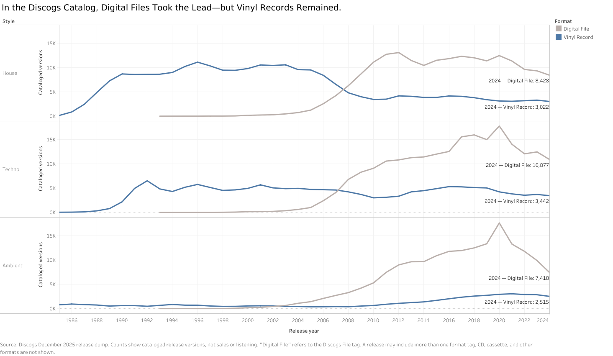

| [Home](https://jessica-jz.github.io/Jessica-Zhang-portfolio/) | [Data visualization examples](https://jessica-jz.github.io/Jessica-Zhang-portfolio/dataviz-examples) | [Visualizing Government Debt](https://jessica-jz.github.io/Jessica-Zhang-portfolio/visualizing-government-debt) | [Critique by Design](https://jessica-jz.github.io/Jessica-Zhang-portfolio/critique-by-design) | [Final project I](https://jessica-jz.github.io/Jessica-Zhang-portfolio/final-project-part-one) | [Final project II](https://jessica-jz.github.io/Jessica-Zhang-portfolio/final-project-part-two) | [Final project III](https://jessica-jz.github.io/Jessica-Zhang-portfolio/final-project-part-three) |

# Wireframes / storyboards

**Working story title:** *In the Discogs Catalog, Digital Files Took the Lead—but Vinyl Records Remained.*

## Story direction

My Part I sketches explored several questions about release formats. When I presented them together, the main story was difficult to identify. For Part II, every section will now answer one question: when digital-file releases took the lead in the Discogs catalog, did Vinyl releases disappear?

The guiding idea is that format change is not always a simple replacement story. I will use annual counts of cataloged release versions because one measure can show both parts of the story: when the Digital file line moved above Vinyl and whether Vinyl later fell to zero. House, Techno, and Ambient will appear as three cases within the same visual rather than as three separate stories.

The finished story will therefore center on one small-multiple line chart. Within each style panel, the comparison is Digital file versus Vinyl across time. The reader is not being asked to rank the three styles. Progressive reveals and annotations will show when Digital file overtook Vinyl and whether Vinyl later approached zero. The intended conclusion is narrow: digital-file dominance and the continued presence of Vinyl releases can occur at the same time in a catalog.

In this project, `Vinyl` and `File` are Discogs format labels. The reader-facing chart will call the latter “Digital file (download).” A release version is one particular edition of a recording. For example, a vinyl edition, a Japanese CD edition, and a FLAC download of the same album count as three release versions. These labels describe release formats, not how the audio was recorded or mastered. The project does not measure listening, sales, or sound quality.

## Storyboard

The Part II draft will use one chart in three progressive states rather than five sketches that compete for attention. Each stage gives the reader one task and advances the same replacement-versus-coexistence question.

### Stage 1: Begin with the visual contradiction

The opening will place the main chart near the beginning and ask readers what happened to Vinyl after Digital file releases moved ahead. A short callout will then explain “release version” with the concrete album-edition example above. A second sentence will clarify that format does not describe recording or mastering technology.

**Storyboard frame:** a short question followed immediately by the first state of the main chart. Definitions appear beside the evidence instead of delaying it.

### Stage 2: Reveal the evidence in one main chart

The hero visual will be one figure with aligned House, Techno, and Ambient panels. Each panel will show annual numbers of cataloged Digital file and Vinyl release versions from 1985 through 2024. Vinyl will use blue, while Digital file will use a quiet warm gray. The lines will be labeled directly so the reader does not have to move between the chart and a separate legend. The x-axis will read “Release year,” and the y-axis will read “Number of cataloged release versions.” All panels and progressive states will use the same time range and count scale.

The chart will be revealed in three steps:

1. Show the Vinyl lines first and ask whether they approach zero.
2. Add the Digital file lines so readers can see when they moved above Vinyl within each style.
3. Add concise annotations for the crossover years and the most important difference among the three panels.

CD will not appear in the main chart because the central comparison is Digital file versus Vinyl. No connector will join the format values at a given year because the categories can overlap and do not form two ends of a 100% scale. A short Ambient callout will note that cassette releases are unusually important for that style, so the two-line comparison does not describe its full physical-format story.

**Storyboard frames:** the same chart in the three states above. The repeated structure should feel like one visual explanation, not three new analyses.

### Stage 3: Resolve the question and define its limits

The ending will return to the opening question: Digital file releases took the lead in this Discogs sample while Vinyl releases continued to appear in thousands of cataloged versions. It will not call this a vinyl revival or make a claim about listener preference. A short note below the chart will name Discogs as the source and explain the unit of analysis. The small amount of format overlap will appear in a footnote rather than interrupting the story. The master-level sensitivity check from Part I will remain in a methods note rather than becoming another visual chapter.

The limitations note will also explain that Discogs is a user-contributed collector database. Physical releases may be more likely to be cataloged than digital-only releases, so the catalog may make Vinyl look more persistent than the full release market. This is a possible source of bias, not a measured correction factor.

**Scenario of use:** a reader should be able to scroll through the three states, identify the two formats without outside explanation, and summarize the conclusion in one sentence. A methods-minded reader can then continue to the limitations without interrupting the main story.

### High-fidelity draft

This draft uses the real Discogs data and a shared count scale. Its claim-based title limits the conclusion to the Discogs catalog, while the direct 2024 labels, axes, legend, and source note allow the chart to be understood on its own. The next version will add only the annotations needed for the progressive story states described above.

## How Part I feedback shaped this storyboard

The comments below were made about my Part I sketches. I used them as preliminary design input for the revised Part II storyboard. They are separate from the Part II interviews described later on this page. One additional critique was framed as a simulated target-audience pretest; I use it only as design critique, not as a completed interview.

| Feedback on the Part I sketches | Change made in the Part II storyboard |
|---|---|
| The intended audience and central story were difficult to identify. | I defined the audience as electronic-music listeners who mainly use digital access but still encounter vinyl editions. Every stage now asks whether the rise of File releases meant that Vinyl releases disappeared. |
| Sketch 2 was the clearest direction. | I selected one File-versus-Vinyl time-series figure as the main visual instead of carrying five competing directions forward. |
| The sketches needed clearer legends, axes, units, and annotations. | The revised plan specifies direct line labels, named axes, a shared scale, crossover annotations, a caption, and the Discogs source. |
| The miniature Vinyl-count and total-catalog lines were difficult to interpret. | I removed both placeholders. The main chart will use annual counts to show the crossover and Vinyl's continued presence. |
| The master-level comparison was difficult to understand. | I moved the master-level sensitivity check to a methods note so the main story keeps one unit of analysis. |
| Connectors between File and Vinyl dots implied a continuum or a 100% total. | I removed the connected-dot designs because the format categories can overlap. |
| The amount of detail created too much cognitive load. | I reduced the reader-facing story to one chart revealed in three stages and moved technical detail below the main narrative. |
| “File” and “release version” were difficult for a general reader to interpret. | The chart will say “Digital file (download),” and the story will explain release versions with a concrete album-edition example. |
| Definitions and methodology delayed the main evidence. | The main chart will appear first, followed by short explanatory callouts. |
| The title made Vinyl's continued presence sound more positive than the comparison warranted. | The working title now states that Digital files overtook Vinyl before stating that Vinyl did not disappear. |
| Ambient's cassette releases and Discogs's collector-community coverage could change the interpretation. | The storyboard adds an Ambient cassette callout and a concise limitation about possible cataloging bias. |

# User research

## Target audience

The primary audience is electronic-music listeners who usually access music through streaming or downloads but still see DJs, record shops, and labels release music on vinyl. A reader may recognize House, Techno, and Ambient and wonder why a new track can be available as both a download and a 12-inch record. The reader is not expected to know how Discogs organizes its database.

These listeners may carry a simple story of technological change: a newer format arrives and the older one disappears. Electronic music makes that expectation worth examining because digital files and vinyl records can both remain visible to the same listener. After reading the story, the audience should understand why “Digital releases became dominant” and “Vinyl releases remained” are not contradictory claims. They should be able to point to the two lines in the main chart as evidence and explain why the chart does not prove that vinyl became more popular.

For the Part II interviews, I will recruit at least three people who have not helped design the revised storyboard. I will try to include electronic-music listeners who mainly use streaming or downloads, because they are closest to the intended audience. A participant does not need to be enrolled in this course. I may also include one data-visualization classmate to check whether the chart can be read without additional explanation. I will describe participants only in broad terms and will not record names or other identifying information on this page.

## Interview script

### Research goals

The protocol tests whether readers can identify the intended audience, central question, and main comparison in the revised Part II storyboard. It also tests whether readers understand the unit of analysis and the limits of the data.

### Interview procedure

Each participant will view the revised storyboard before I explain the intended conclusion. I will ask the same core questions and take anonymous notes. For each question, I will record whether the answer showed clear, partial, or incorrect understanding and capture an exact quotation when the participant agrees. After the interviews, I will compare repeated observations with conflicting interpretations rather than treating every suggestion as a required change.

### Questions

| Research goal | Question |
|---|---|
| Test whether the audience is apparent | Who do you think this story is for? |
| Test whether the central question is clear | In one sentence, what do you think this story is trying to explain? |
| Test the main comparison | What does the main chart want you to notice? |
| Test the main conclusion | How would you describe the change in Vinyl releases over this period? What evidence led you to that answer? |
| Test the unit of analysis | What do you think “release version” means here? |
| Test the style comparison | What difference, if any, do you notice among House, Techno, and Ambient? |
| Test chart readability | Point to the year when Digital file releases first exceeded Vinyl releases for Techno. |
| Test the limits | What can this data tell us, and what can it not tell us? |
| Identify friction | Where did you feel confused, uncertain, or less interested? |
| Invite redesign suggestions | What would you change first? |

## Interview findings

The Part II interviews have not yet been conducted. The comments in the wireframes section concern the Part I sketches and are not counted here as findings about the revised storyboard. After at least three participants review the Part II version, I will document their broad descriptions, specific observations, any exact quotations I recorded with permission, similarities or disagreements across interviews, and what each finding means for the design.

# Identified changes for Part III

I will complete this section after the Part II interviews. For each repeated or conflicting observation, I will state whether I plan to adopt it, adapt it, or leave the design unchanged, and explain why. The resulting Part III changes may affect the annotations, reading order, amount of methodological detail, or wording of the conclusion. I will keep the data limitations and will not turn catalog records into claims about sales, listening, popularity, or sound quality.

## References

Discogs. “Discogs Data.” Monthly database dumps. https://data.discogs.com/

Discogs. “Database Guidelines 6: Format.” https://support.discogs.com/hc/en-us/articles/360005006654-Database-Guidelines-6-Format

Berinato, Scott. *Good Charts*. Chapter 7, “Persuasion or Manipulation? The Blurred Edge of Truth.”

## AI acknowledgements

I used ChatGPT to critique my initial project direction, which helped me narrow the topic to one central story and one main chart. I also used it for a simulated target-audience critique, to revise and polish the writing, to organize and anonymize the peer feedback I collected, and to refine the Tableau chart title, axis range, labels, and source note. The simulated critique is labeled separately and is not counted as an interview. The human feedback came from my classmates; ChatGPT did not generate or alter their comments or quotations.
