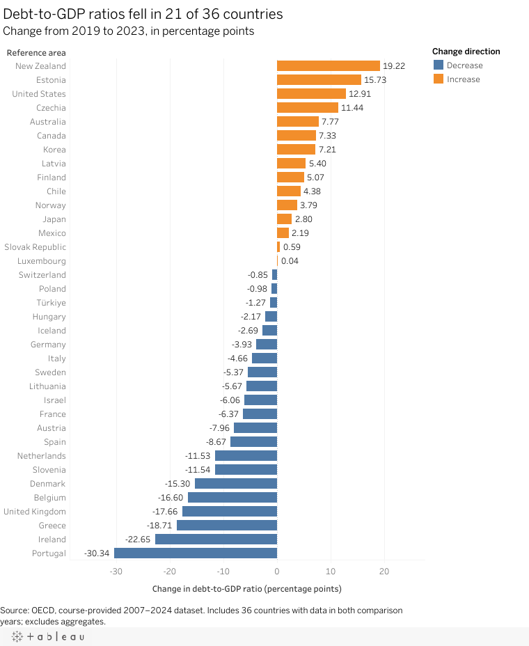

| [Home](./) | [Data visualization examples](dataviz-examples) | [Visualizing Government Debt](visualizing-government-debt) | [Critique by Design](critique-by-design) | [Final project I](final-project-part-one) | [Final project II](final-project-part-two) | [Final project III](final-project-part-three) |

# Visualizing Government Debt

For this Tableau assignment, I used OECD data on general government debt as a percentage of GDP. After completing the tutorial highlight table, I created a different view for the final visualization: a sorted horizontal bar chart comparing the change in each country's debt-to-GDP ratio between 2019 and 2023.

[Open the interactive visualization on Tableau Public](https://public.tableau.com/views/OECDDebt-to-GDPChange2019-2023/Sheet1?:showVizHome=no)

## What I wanted to show

I included the 36 countries that had data for both years and excluded the OECD and regional aggregate rows. The ratio fell in 21 of the 36 countries. I used a sorted horizontal bar chart so readers can quickly compare the direction and size of each change. Orange represents an increase, while blue represents a decrease. The values show changes in percentage points, rather than each country's total debt or its debt level in a single year.

## Design process

This chart communicates my main point more directly than the tutorial heatmap. The heatmap is useful for following debt levels across many years, but the large number of values takes longer to interpret. My bar chart focuses on one comparison and makes the largest increases and decreases easier to identify. During my design process, I tried fitting every country on the screen, but the labels became crowded. I changed the layout so the country names remained readable and viewers could scroll through the complete ranking in Tableau Public.

The diverging layout places zero at the center, making the direction of change visible before the reader examines the exact value. The title states the main finding, while the subtitle and axis specify that the chart measures percentage-point changes from 2019 to 2023. A decrease in the ratio does not necessarily mean that the country's total debt fell because the ratio also depends on GDP.

## Data source

Organisation for Economic Co-operation and Development. [“General Government Debt.”](https://www.oecd.org/en/data/indicators/general-government-debt.html) Course-provided 2007–2024 dataset.

Secondary sources: None.

## AI acknowledgement

I used ChatGPT to help me revise the writing.
